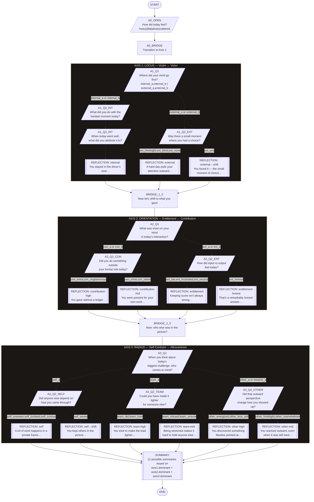

# Reflection Tree — Branching Diagram

## Node Count

| Type | Count |
|---|---|
| start | 1 |
| question | 11 |
| decision | 7 |
| reflection | 12 |
| bridge | 3 |
| summary | 1 |
| end | 1 |
| **Total** | **36** |

## Possible Paths

- **Axis 1:** 2 main branches (internal → 1 path, external → 2 paths based on "yes I took it") = 3 distinct axis-1 paths
- **Axis 2:** 2 main branches (contribution → 2, entitlement → 2) = 4 distinct axis-2 paths
- **Axis 3:** 3 main branches (self → 2, team → 2, other → 2) = 6 distinct axis-3 paths

**Total distinct full paths:** 3 × 4 × 6 = **72 possible conversations**
**Total distinct summary reflections:** 12 (one per axis-combination key)
